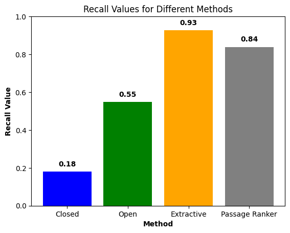
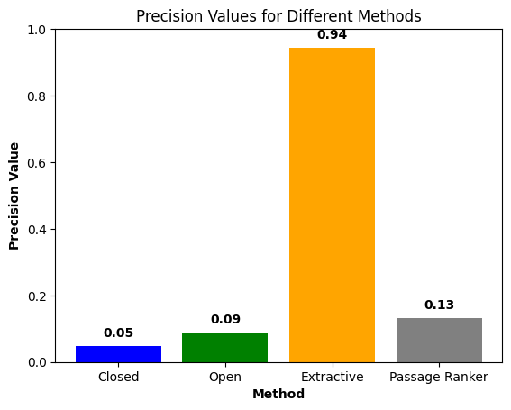

# IR-meets-LLM

## Introduction
The research and development of Q&A models has risen dramatically in the past years. Through that reason, we want to explore the 3 main Q&A models:
- Extractive Model
- Open Generative Model
- Closed Generative Model

and analyze its advantages and disadvantages, whereas we provide the most important passage from the context (Passage Ranking through Bi-Encoder) to the extractive and the open generative model.

## Research Question
How do Extractive Models, Open Generative Models, and Closed Generative Models compare in terms of providing accurate answers based on given data? 

## Result
**Recall Definition:**  For each possible correct answer, calculate the intersection of correct answer and our answer and then take the answer with maximum value and ultimately divide this value by the length of the correct answer.

**Precision Definition:** Amount of correct words we have, divided by length of our answer.

  

